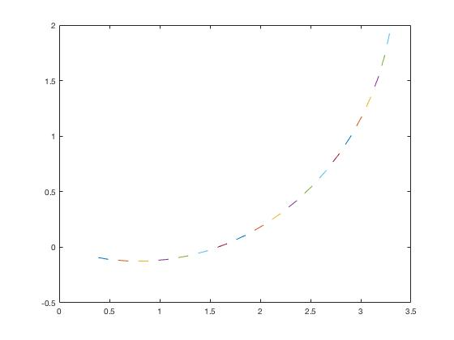
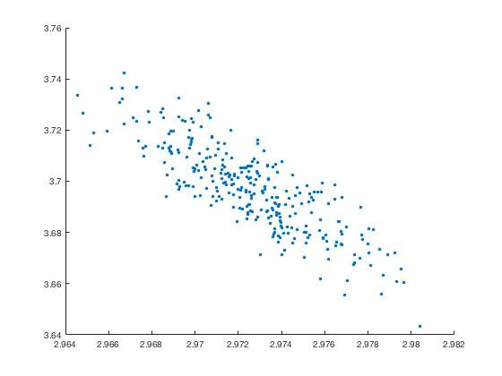
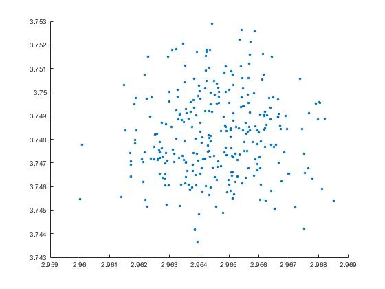
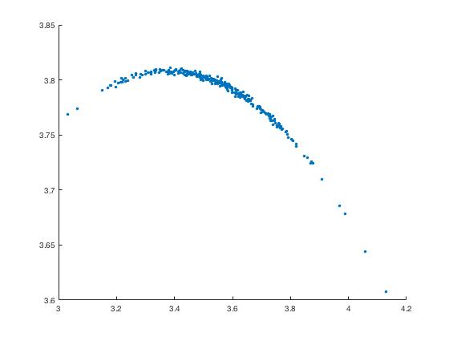

# Ideal and Noisy Probabilistic 2D Velocity Motion Model

This repository gives the MATLAB implementation of the velocity motion model presented in Probabilistic Robotics (1).

[1] Thrun, S. (2002). Probabilistic robotics. Communications of the ACM, 45(3), 287. https://doi.org/10.1145/504729.504754

## Ideal Velocity Motion Model

The ideal motion model implementation is presented by the function
motion_model_ideal(X, u, dt) in the file titled ideal_motion_model.m

Figure below illustrates poses of the ideal motion between the initial pose x0 = (0 0 − pi/10)T and final pose for time step dt = 0.1 and number of steps N = 20.

## Noisy Velocity Motion Model

The noisy motion model implementation is presented by the function
motion_model_noisy(X, u, dt, noise) in the file titled noisy_motion_model.m

Three figures below illustrate samples of the noisy motion for the final pose for command u = (2 pi/4)T , time step dt = 1 and number of samples N = 300 using different noise variances.

